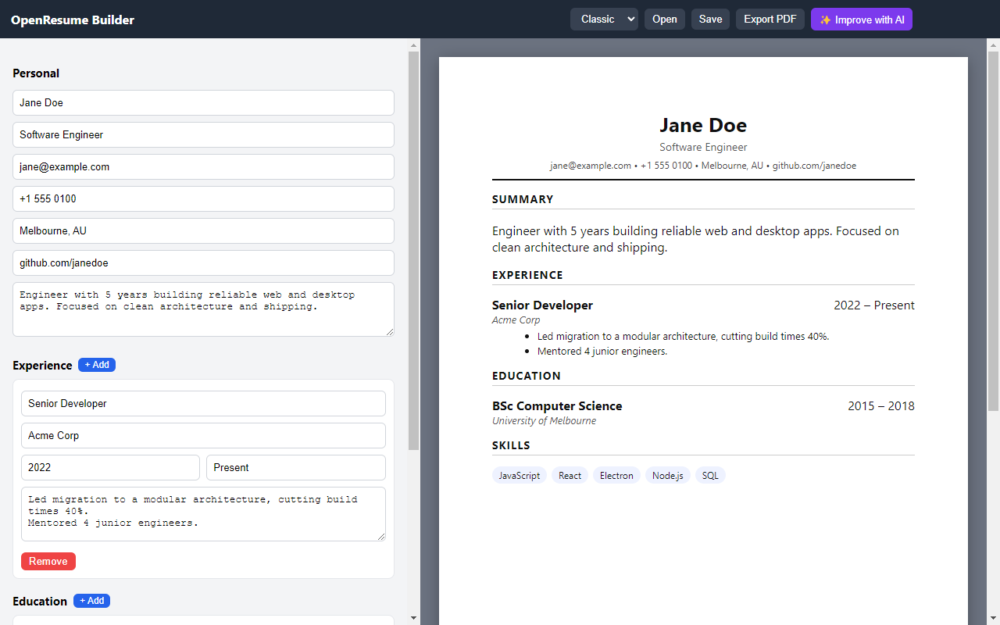

# OpenResume Builder

A free, open-source, cross-platform resume builder built with **Electron + React + Vite**.

## Features

- **Customizable resume sections** — Experience, Education, Skills, Projects, Certifications, and free-form Custom sections; add, remove, rename, and reorder whole sections, and reorder individual entries within a section
- **Three templates** — Classic, Modern, and Resumatic (serif, bold header), switchable from a live-thumbnail template gallery
- **Template / Details / Final Preview workspace** — pick a template visually, edit in the section-based form, then check a clean chrome-free preview before exporting
- **WYSIWYG bold/italic** — Experience descriptions, Custom Section, and Skills render real bold/italic as you type, no visible `**`/`*` markup; combinable into bold+italic, with a Word/LibreOffice-style bullet & numbering picker (•, ○, ▪, –, 1., a., A., i., I.), an intro-sentence-before-the-list option, and Word-style list editing (Ctrl+]/Ctrl+[ to indent, Enter continues the list)
- **Month/year date picker** — click a Start/End field (Experience, Education, Projects) for a year navigator and month grid, with a "Present" quick-pick and future dates blocked automatically
- **Autocomplete & autocorrect** — suggestion dropdowns for Title, Role, Skill, and Degree fields, plus real spellcheck with right-click correction suggestions
- **Snapshot backups** — take a named, timestamped snapshot at any point, then browse/restore/rename/delete from a table, with a confirmation warning before restoring
- **Autosave status indicator** — "Saving…" / "All changes saved" in the toolbar
- **Save / Open as JSON** — via the native File menu (Ctrl+O / Ctrl+Shift+S) — keep multiple resume files and reopen them anytime
- **Export to PDF** — one click, ready to send to employers
- **AI Improve button** — stubbed in for an upcoming AI-assisted rewrite feature

## Screenshots

| Template gallery | Final preview |
|---|---|
|  |  |

| Text formatting & sub-bullets | Named snapshots |
|---|---|
|  |  |

More in the [wiki Screenshots page](https://github.com/AbhisekkumarShandilya/openresume-builder/wiki/Screenshots).

## Download

Get the latest build from the [Releases page](https://github.com/AbhisekkumarShandilya/openresume-builder/releases/latest):

- **Windows** — installer (`Setup.exe`) or portable (`.exe`)
- **macOS** — `.dmg` for Apple Silicon or Intel (built via CI, currently untested on real Mac hardware)
- **Linux** — `.AppImage` (built via CI, currently untested on a real Linux machine) — see the [wiki's Linux install/run instructions](https://github.com/AbhisekkumarShandilya/openresume-builder/wiki/Installation#linux) for `chmod +x`, FUSE troubleshooting, and desktop integration

These are unsigned builds, so Windows SmartScreen / macOS Gatekeeper will warn about an unidentified developer the first time you run one.

## Roadmap

See [TODO.md](TODO.md) for planned work (UI polish, more sections, full AI integration, Android build).

## Contributing / running from source

See [DEVELOPMENT.md](DEVELOPMENT.md) for setup, running in dev mode, and building installers yourself.

## License

MIT — free to use, modify, and distribute.
